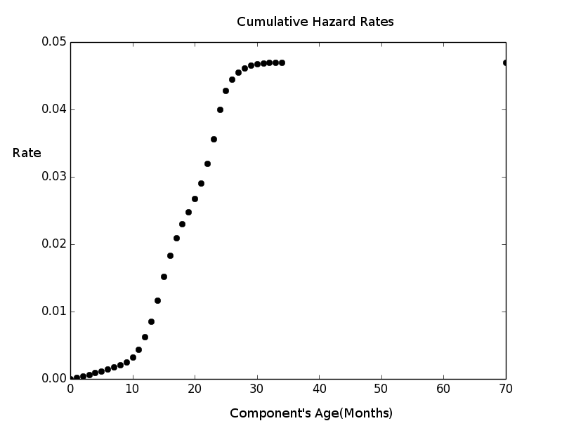

Title: Kaggle's Asus Competition - got into top 25%
Date: 2014-04-11 10:20
Category: Python
Tags: python, machinelearning, kaggle
Slug: kaggle-asus-failure-survival-analysis
Author: Alex Parij
Summary: Kaggle's PAKDD 2014 competition to predict future malfunctional components of ASUS notebooks from historical data

I recently finished participating in Kaggle's ASUS competition which was about predicting future malfunctional 
components of ASUS notebooks from historical data. My final placement in this competition was 140/614 that is the top 25%, for which I'm very happy.
Considering the fact that it was more about time-series forecasting and less to do with core machine learning algorithms, I've done well. 

Basically I was given two data sources, one is sales and another repairs.
Sales data was from January/2005 to February/2008 :

module_category | component_category | year/month | number_sale
----------------|--------------------|------------|-------------
M4              |       P10          | 2007/1     |   0
M4              |       P27          | 2005/5     |  1042
M1              |       P22          | 2005/9     |  1677

Repairs data was from February/2005 to December/2009, for example:

module_category|component_category|year/month(sale)|year/month(repair)|number_repair
---------------|------------------|----------------|------------------|------------
M6|P16|2007/9|2009/4|1
M2|P30|2007/9|2009/8|1
M1|P12|2006/10|2008/2|2
M1|P30|2006/5|2007/7|1
M3|P06|2007/8|2007/12|1
M7|P19|2006/7|2007/6|1

And I was trying to predict the monthly repair amount for each module-component from January/2010 to July/2011 (for 19 months) .
The prediction was evaluated using mean absolute error (MAE) which is the difference bertween the number of repairs I predicted 
vs real repairs data ASUS had, devided by total of prediction rows.

Just to explore the data using Python's Pandas DataFrame, grouping by module,component and date,.

     repair_data.groupby(['module_category','component_category','year/month(repair)'],as_index=False).agg({'number_repair':np.sum})

Just one component's graph of the total repairs 2005 to 2009 time series will look like this :

We can see that the number of repairs grows as more components are sold and also as the time passes, but falls off around two years mark 
as the first sold models reach that age. Not sure why the drop but my assumption was that the warranty expired.
 The number of repairs in the end of 2009 is zero or almost zero for most components and we need to predict what happens in the next 19 months.
The easiest would be just take the last points and fit some linear regression or moving average,
 that would bring us above the baseline(which is predict that we have only zero repairs) but it would not be the best model. 

My most most successful model was built using a simple survival analysis
 (using Python's [Lifelines](https://github.com/CamDavidsonPilon/lifelines) package) blended with linear regression for 
the tail of the 19 months to forecast

I took the time from sale of component to repair as time to death/event and the rest of the components were right censored(never had death event).
Didn't matter when the component was sold because it was all relative. I got let's say couple of thousands deaths with 1 to ~ 45 months from been
 sold to the repaired/death event and ~500k of right censored items and then estimated the hazard rates using [Nelson-Aalen estimator](http://en.wikipedia.org/wiki/Nelson%E2%80%93Aalen_estimator) from
Lifelines library.
data would look like this, an array of deaths :

      data_events[0:100]
      array([ 70.,   1.,   1.,   1.,   1.,   1.,   1.,   1.,   2.,   2.,   2.,
         2.,   2.,   2.,   2.,   2.,   2.,   2.,   2.,   2.,   2.,   2.,
         2.,   2.,   2.,   2.,   2.,   2.,   2.,   2.,   3.,   3.,   3.,
         3.,   3.,   3.,   3.,   3.,   3.,   3.,   3.,   3.,   3.,   3.,
         3.,   3.,   3.,   3.,   3.,   3.,   3.,   3.,   3.,   3.,   3.,
         3.,   3.,   3.,   3.,   3.,   3.,   3.,   3.,   3.,   3.,   3.,
         3.,   3.,   3.,   3.,   3.,  12.,  12.,  12.,  12.,  12.,  12.,
        12.,  12.,  12.,  12.,  12.,  12.,  12.,  12.,  12.,  12.,  12.,
        12.,  12.,  12.,  12.,  12.,  12.,  12.,  12.,  12.,  12.,  12.,
        12.])

the first cell for example has a value of 70 it is a component that never was repaired but right censored, it can be any arbitrary high number. other cells with values like 1 or 12 or 3
is after how many months the component was repaired. If it was sold in September/2008 and repaired in September/2009 it means 12 months later death event occured. So I would  have arrays of size around 500k mostly with a value of 70 (component that never repaired).
Fitting the data:

   naf = NelsonAalenFitter()
   naf.fit(data_events, event_observed=C )

C is the index of right censored components in the array (the ones with 70)
	    
	  
 What I get is the cumulative hazard rate, which is an integration of survival function

      naf.cumulative_hazard_
			
	    timeline   NA-estimate          
	    0            0.000000
	    1            0.000071
	    2            0.000339
	    3            0.000785
	    4            0.001369
	    5            0.001962
	    ...
	    ...

What is important in this graph is the rate of change, in the beginning the slope is quite high that is basically gives high hazard rate at any moment(more repairs) and then after two years it would
stabilize and have almost a zero slope which is equivalent to no or very little repairs/death events.
let's say 10000 components were sold on Nov/2009 I need to know how many of them will be repaired in Feb/2010 which is 3 months after the sale. From the cumulative hazard  I can see that
at 3 months the cumulative hazard is 0.000785 and at 2 months  0.000339 , the slope will be 0.000785-0.000339=.000446 . Taking the population multiplied by instantenious hazard 
10000*0.000446 = 4.46 . On Feb/2010 4 components will be returned for repairs.
Based on the data, usually from 0 to 45 months it gave a nice prediction but for components that were sold earlier and I had to extrapolate how many will be repaired after 4-5 years I used a modified linear regression based only on the last couple of points and I would slowly decay the hazard value from this regression.    
I would also manually add extra weight for summer months, because it looked like in summer months the components failed more.

The red dots are the forecasted repairs.

The source for the Python implementation is on Github [Code](https://github.com/aparij/kaggle_asus) 

I also tried:

Aalen’s Additive model from survival analysis, which is a regression model with multiple covariabts. It was too slow and a bit worse results, 
maybe I chose bad covariants(sale seasons, months...).
I read some participants managed to rank top spots using Cox model which is another regression model from survival analysis.

I also did VAR and ARMA from time series analysis in python's statsmodels but it worked badly or I just didn't understand it properly

Big thanks to Cameronon Davidson-Pilon for writing the excellent Lifelines package for Python.

